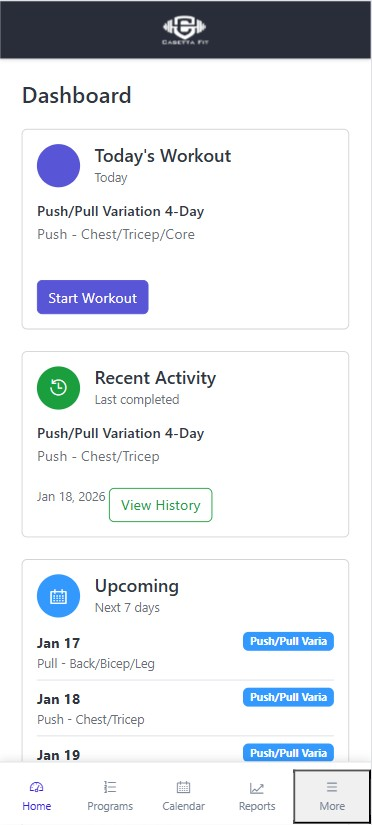
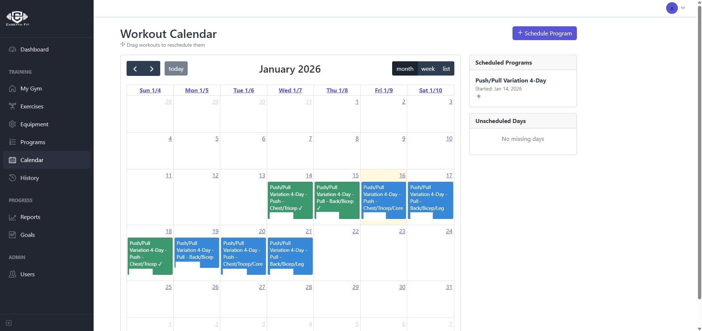
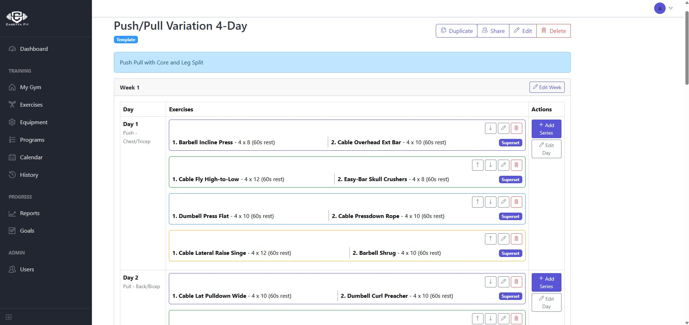
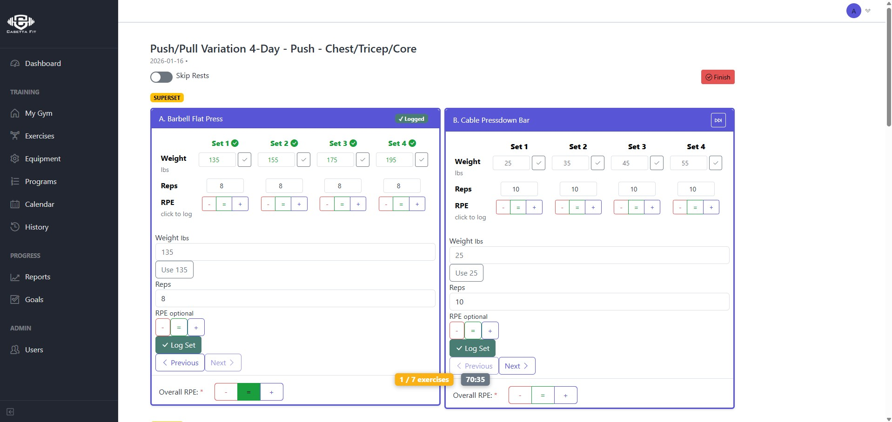
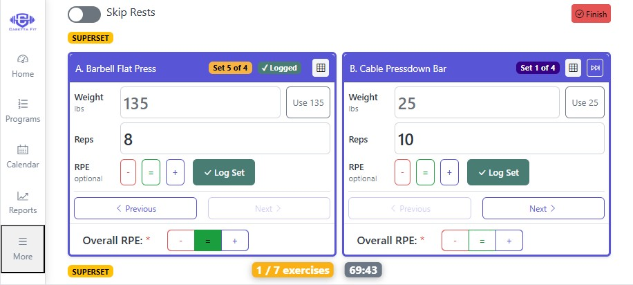
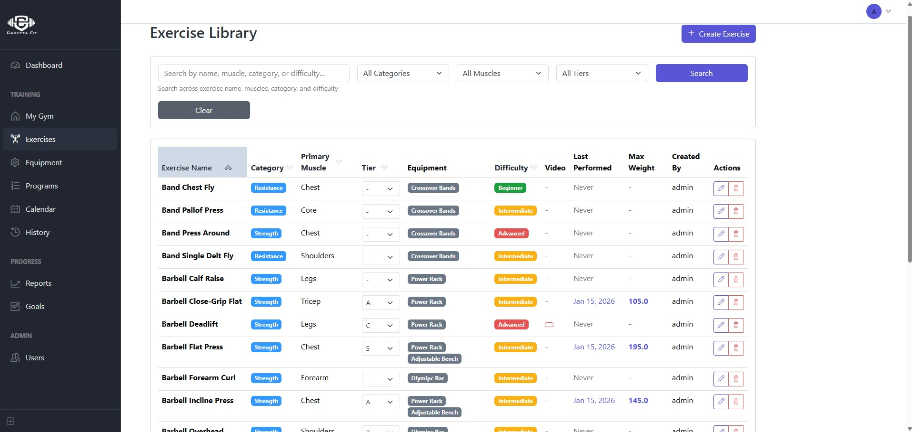
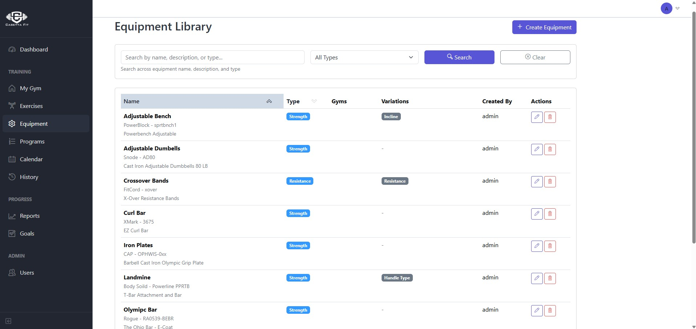
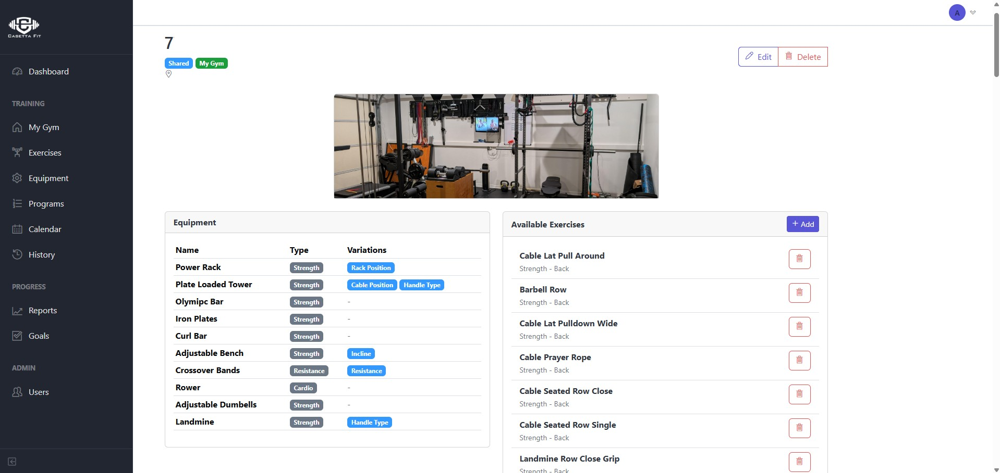
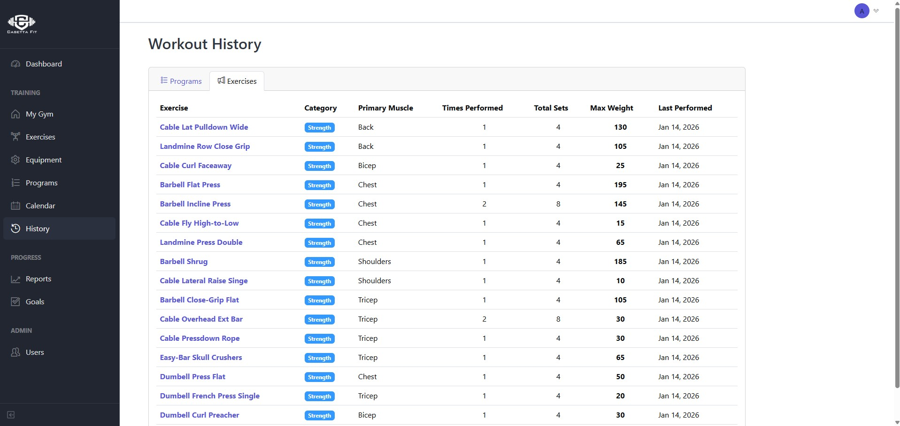

# CasettaFit 💪

**A powerful, self-hosted workout tracking application for home gym enthusiasts**

CasettaFit is a comprehensive fitness tracking platform that helps you plan workouts, log exercises, track progress, and achieve your strength training goals. Built with Flask and designed for easy self-hosting on your own server.

[](https://opensource.org/licenses/MIT)
[](https://www.python.org/downloads/)
[](https://flask.palletsprojects.com/)

## ✨ Features

### 📋 Program & Workout Planning
- **Custom Programs**: Create multi-week training programs with progressive overload
- **Workout Days**: Organize exercises by day with series and supersets
- **Exercise Library**: Comprehensive exercise database with custom additions
- **Smart Suggestions**: Auto-populate weights based on previous performance

### 🏋️ Workout Execution
- **Live Workout Mode**: Execute workouts with real-time tracking
- **Mobile-Optimized**: Responsive design works great on phones and tablets
- **Previous Set History**: See your last performance for each exercise
- **RPE Tracking**: Log Rate of Perceived Exertion for each set
- **Rest Timers**: Automatic rest period countdown between sets
- **Skip Rest Option**: Toggle to skip rest timers when needed

### 📊 Progress Tracking
- **Workout History**: Complete log of all past workouts
- **Exercise Analytics**: Track progress over time for each exercise
- **Goal Setting**: Set and monitor fitness goals
- **Visual Reports**: Charts and graphs showing your progress

### 🏠 Gym Management
- **Multiple Gyms**: Track different gym locations (home, commercial, etc.)
- **Equipment Tracking**: Manage available equipment at each location
- **Exercise-Gym Mapping**: Link exercises to specific gym equipment

### 👥 User Management
- **Admin Dashboard**: Manage multiple users
- **User Profiles**: Personal settings and preferences
- **Role-Based Access**: Admin and regular user roles

### 🔒 Security & Deployment
- **Self-Hosted**: Keep your fitness data private on your own server
- **SSL/HTTPS Support**: Secure connections with Let's Encrypt or custom certificates
- **Production Ready**: Gunicorn + NGINX setup included
- **Systemd Service**: Auto-start on boot, easy management

## 📸 Screenshots

### Dashboard & Calendar
The main dashboard gives you an overview of your training schedule and upcoming workouts.

<table>
  <tr>
    <td width="50%">
      
      <p align="center"><em>Dashboard - Mobile View</em></p>
    </td>
    <td width="50%">
      
      <p align="center"><em>Workout Calendar - Desktop</em></p>
    </td>
  </tr>
</table>

### Program Management
Create and organize multi-week training programs with custom exercises and progression.

<p align="center">
  
  <br><em>Program Planning Interface</em>
</p>

### Workout Execution
Log your workouts with an intuitive interface optimized for both desktop and mobile use.

<table>
  <tr>
    <td width="50%">
      
      <p align="center"><em>Live Workout - Desktop View</em></p>
    </td>
    <td width="50%">
      
      <p align="center"><em>Live Workout - Mobile View</em></p>
    </td>
  </tr>
</table>

### Exercise Library & Management
Browse and manage your exercise library with categories and custom additions.

<table>
  <tr>
    <td width="50%">
      
      <p align="center"><em>Exercise Library</em></p>
    </td>
    <td width="50%">
      
      <p align="center"><em>Equipment Management</em></p>
    </td>
  </tr>
</table>

### Gym & History Tracking
Manage multiple gym locations and review your complete workout history.

<table>
  <tr>
    <td width="50%">
      
      <p align="center"><em>Gym Setup & Management</em></p>
    </td>
    <td width="50%">
      
      <p align="center"><em>Workout History & Analytics</em></p>
    </td>
  </tr>
</table>

### Mobile Schedule View
Plan and schedule your workouts with the mobile-friendly calendar interface.

<p align="center">
  
  <br><em>Mobile Schedule Planning</em>
</p>

## 🚀 Quick Start

### Installation

1. **Clone the repository**
```bash
git clone https://github.com/YOUR_USERNAME/CasettaFit.git /opt/CasettaFit
cd /opt/CasettaFit/app
```

2. **Run the installation script**
```bash
sudo bash setup.sh
```

This will:
- Install Python dependencies
- Set up the database
- Create a systemd service
- Configure NGINX
- Create an admin user

3. **Configure SSL/HTTPS** (recommended):
```bash
sudo bash setup_ssl.sh
```

### First Login

- **URL**: https://your-server-ip/ or https://your-domain.com/
- **Username**: admin
- **Password**: adminpass

⚠️ **Change the admin password immediately after first login!**

## SSL/HTTPS Setup

CasettaFit supports three SSL certificate options. See [SSL_SETUP.md](SSL_SETUP.md) for detailed instructions.

### Option 1: Let's Encrypt (Recommended for Production)

**Automated setup:**
```bash
cd /opt/CasettaFit/app
sudo bash setup_ssl_auto.sh
```

**Manual setup:**
```bash
sudo bash setup_ssl.sh
# Select option 1
# Enter your domain name
```

**Features:**
- Free trusted SSL certificate
- Auto-renewal every 90 days
- No browser warnings

### Option 2: Self-Signed Certificate (Development/Testing)

```bash
sudo bash setup_ssl.sh
# Select option 2
```

**Note:** Browsers will show security warnings. Click "Advanced" → "Proceed" to continue.

### Option 3: Custom Certificate Upload

If you have your own SSL certificate:
```bash
sudo bash setup_ssl.sh
# Select option 3
# Provide paths to your certificate files
```

For detailed SSL setup instructions, troubleshooting, and certificate management, see **[SSL_SETUP.md](SSL_SETUP.md)**.

## System Service Management

The application runs as a systemd service using Gunicorn as the production WSGI server.

### Quick Commands

```bash
# Check service status
sudo systemctl status casettafit.service

# Start/Stop/Restart service
sudo systemctl start casettafit.service
sudo systemctl stop casettafit.service
sudo systemctl restart casettafit.service

# View real-time logs
sudo journalctl -u casettafit.service -f
```

### After Making Code Changes

```bash
sudo systemctl restart casettafit.service
```

### After Database Migrations

```bash
cd /opt/CasettaFit
source app/venv/bin/activate
flask db upgrade
sudo systemctl restart casettafit.service
```

### Application Logs

- **Access Log**: `/opt/CasettaFit/logs/access.log`
- **Error Log**: `/opt/CasettaFit/logs/error.log`

```bash
# View logs
tail -f /opt/CasettaFit/logs/access.log
tail -f /opt/CasettaFit/logs/error.log
```

## Service Configuration

- **Service File**: `/etc/systemd/system/casettafit.service`
- **Port**: 5000
- **Workers**: 4 Gunicorn workers
- **Auto-start**: Enabled on boot
- **User**: casettalocal

## NGINX Reverse Proxy

The application uses NGINX as a reverse proxy to the Gunicorn application server.

### Configuration

- **Config File**: `/etc/nginx/sites-available/casettafit`
- **Ports**: 
  - 80 (HTTP) - Redirects to HTTPS when SSL is configured
  - 443 (HTTPS) - Primary access when SSL is configured
- **Max Upload Size**: 10MB

### SSL Configuration

After running the initial setup, configure SSL using:
```bash
cd /opt/CasettaFit/app
sudo bash setup_ssl.sh
```

See [SSL_SETUP.md](SSL_SETUP.md) for detailed SSL setup instructions.

### Accessing the Application

- **With SSL**: `https://your-domain.com/`
- **Without SSL**: `http://your-server-ip/`

### NGINX Commands

```bash
# Test configuration
sudo nginx -t

# Reload configuration
sudo systemctl reload nginx

# Restart NGINX
sudo systemctl restart nginx

# View NGINX logs
sudo tail -f /var/log/nginx/access.log
sudo tail -f /var/log/nginx/error.log
```

## Database Management

### Migrations

### Service Won't Start
```bash
# Check detailed status and logs
sudo systemctl status casettafit.service
sudo journalctl -u casettafit.service -n 100
tail -50 /opt/CasettaFit/logs/error.log
```

### Check Port Usage
```bash
sudo netstat -tulpn | grep :5000
```

### Reload Service Configuration
After editing `/etc/systemd/system/casettafit.service`:
```bash
sudo systemctl daemon-reload
sudo systemctl restart casettafit.service
```

## 🛠️ Tech Stack

- **Backend**: Flask (Python)
- **Database**: SQLite with SQLAlchemy ORM
- **Frontend**: Bootstrap 5, Vanilla JavaScript
- **Server**: Gunicorn + NGINX
- **Deployment**: Systemd service management

## 📱 Mobile Support

CasettaFit is fully responsive with dedicated mobile views:
- One-at-a-time set logging for focused workouts
- Large touch targets for gym use
- Landscape mode optimization
- Works offline once loaded (PWA-ready)

## 🤝 Contributing

Contributions are welcome! Please feel free to submit a Pull Request. For major changes, please open an issue first to discuss what you would like to change.

1. Fork the repository
2. Create your feature branch (`git checkout -b feature/AmazingFeature`)
3. Commit your changes (`git commit -m 'Add some AmazingFeature'`)
4. Push to the branch (`git push origin feature/AmazingFeature`)
5. Open a Pull Request

## 📝 License

This project is licensed under the MIT License - see the [LICENSE](LICENSE) file for details.

## 🙏 Acknowledgments

- Built for home gym enthusiasts who value data privacy
- Inspired by the need for a self-hosted fitness tracking solution
- Thanks to all contributors and users!

## 📧 Support

If you encounter any issues or have questions:
- Open an issue on GitHub
- Check existing issues for solutions
- See the troubleshooting section in [SSL_SETUP.md](SSL_SETUP.md)

## 🗺️ Roadmap

Future features planned:
- [ ] Export workout data (CSV, JSON)
- [ ] Progressive overload calculator
- [ ] Exercise instruction videos/images


---


